| Stage Name                        |Props                                                                              |Stage Grid                                                                      |Screenshot                                           |
|-----------------------------------|-----------------------------------------------------------------------------------|--------------------------------------------------------------------------------|-----------------------------------------------------|
| md-test-v0	                    |[test.json](gym_md/envs/props/test.json)                                           |[test.txt](gym_md/envs/stages/test.txt)                                         | 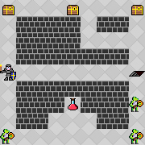        |
| md-edge-v0	                    |[edge.json](gym_md/envs/props/edge.json)                                           |[edge.txt](gym_md/envs/stages/edge.txt)                                         |         |
| md-hard-v0	                    |[hard.json](gym_md/envs/props/hard.json)                                           |[hard.txt](gym_md/envs/stages/hard.txt)                                         |         |
| md-random_1-v0	                |[random_1.json](gym_md/envs/props/random_1.json)                                   |[random_1.txt](gym_md/envs/stages/random_1.txt)                                 | 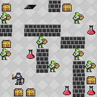    |
| md-random_2-v0	                |[random_2.json](gym_md/envs/props/random_2.json)                                   |[random_2.txt](gym_md/envs/stages/random_2.txt)                                 | 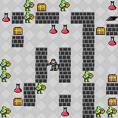    |
| md-gene_1-v0	                    |[gene_1.json](gym_md/envs/props/gene_1.json)                                       |[gene_1.txt](gym_md/envs/stages/gene_1.txt)                                     | 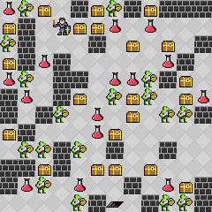      |
| md-gene_2-v0	                    |[gene_2.json](gym_md/envs/props/gene_2.json)                                       |[gene_2.txt](gym_md/envs/stages/gene_2.txt)                                     | 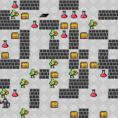      |
| md-strand_1-v0	                |[strand_1.json](gym_md/envs/props/strand_1.json)                                   |[strand_1.txt](gym_md/envs/stages/strand_1.txt)                                 | 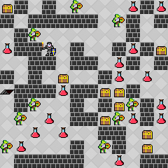    |
| md-strand_2-v0	                |[strand_2.json](gym_md/envs/props/strand_2.json)                                   |[strand_2.txt](gym_md/envs/stages/strand_2.txt)                                 | 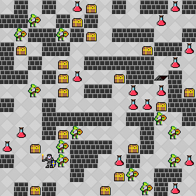    |
| md-strand_3-v0	                |[strand_3.json](gym_md/envs/props/strand_3.json)                                   |[strand_3.txt](gym_md/envs/stages/strand_3.txt)                                 | 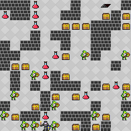    |
| md-strand_4-v0	                |[strand_4.json](gym_md/envs/props/strand_4.json)                                   |[strand_4.txt](gym_md/envs/stages/strand_4.txt)                                 | 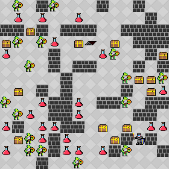    |
| md-strand_5-v0	                |[strand_5.json](gym_md/envs/props/strand_5.json)                                   |[strand_5.txt](gym_md/envs/stages/strand_5.txt)                                 | 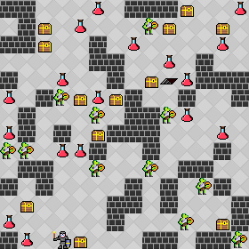    |
| md-check_1-v0                     |[check_1.json](gym_md/envs/props/check_1.json)                                     |[check_1.txt](gym_md/envs/stages/check_1.txt)                                   | 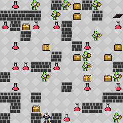     | 
| md-check_2-v0	                    |[check_2.json](gym_md/envs/props/check_2.json)                                     |[check_2.txt](gym_md/envs/stages/check_2.txt)                                   | 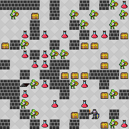     |
| md-check_3-v0	                    |[check_3.json](gym_md/envs/props/check_3.json)                                     |[check_3.txt](gym_md/envs/stages/check_3.txt)                                   | 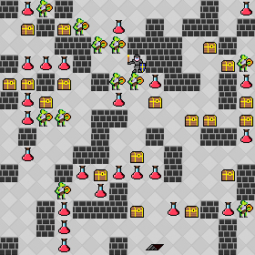     |
| md-holmgard_0-v0                  |[Holmgard_0.json](gym_md/envs/props/Holmgard_0.json)                               |[Holmgard_0.txt](gym_md/envs/stages/Holmgard_0.txt)                             | 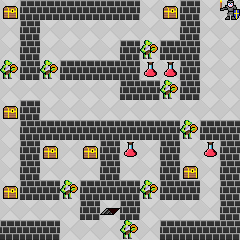  |
| md-holmgard_1-v0 	                |[Holmgard_1.json](gym_md/envs/props/Holmgard_1.json)                               |[Holmgard_1.txt](gym_md/envs/stages/Holmgard_1.txt)                             | 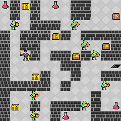  |
| md-holmgard_2-v0 	                |[Holmgard_2.json](gym_md/envs/props/Holmgard_2.json)                               |[Holmgard_2.txt](gym_md/envs/stages/Holmgard_2.txt)                             |   |
| md-holmgard_3-v0 	                |[Holmgard_3.json](gym_md/envs/props/Holmgard_3.json)                               |[Holmgard_3.txt](gym_md/envs/stages/Holmgard_3.txt)                             | 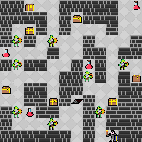  |
| md-holmgard_4-v0 	                |[Holmgard_4.json](gym_md/envs/props/Holmgard_4.json)                               |[Holmgard_4.txt](gym_md/envs/stages/Holmgard_4.txt)                             | 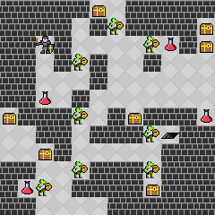  |
| md-holmgard_5-v0 	                |[Holmgard_5.json](gym_md/envs/props/Holmgard_5.json)                               |[Holmgard_5.txt](gym_md/envs/stages/Holmgard_5.txt)                             | 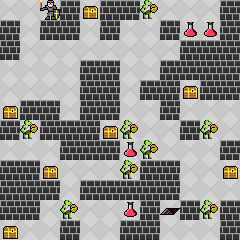  |
| md-holmgard_6-v0 	                |[Holmgard_6.json](gym_md/envs/props/Holmgard_6.json)                               |[Holmgard_6.txt](gym_md/envs/stages/Holmgard_6.txt)                             | 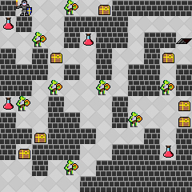  |
| md-holmgard_7-v0 	                |[Holmgard_7.json](gym_md/envs/props/Holmgard_7.json)                               |[Holmgard_7.txt](gym_md/envs/stages/Holmgard_7.txt)                             | 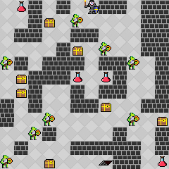  |
| md-holmgard_8-v0 	                |[Holmgard_8.json](gym_md/envs/props/Holmgard_8.json)                               |[Holmgard_8.txt](gym_md/envs/stages/Holmgard_8.txt)                             | 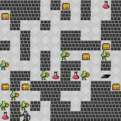  |
| md-holmgard_9-v0	                |[Holmgard_9.json](gym_md/envs/props/Holmgard_9.json)                               |[Holmgard_9.txt](gym_md/envs/stages/Holmgard_9.txt)                             | 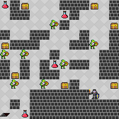  |
| md-holmgard_10-v0                 |[Holmgard_10.json](gym_md/envs/props/Holmgard_10.json)                             |[Holmgard_10.txt](gym_md/envs/stages/Holmgard_10.txt)                           | 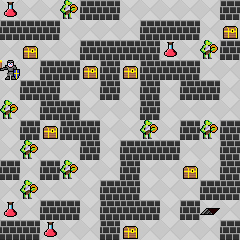 |
| md-constant-holmgard_0-v0         |[ConstantHolmgard_0.json](gym_md/envs/props/ConstantHolmgard_0.json)               |[ConstantHolmgard_0.txt](gym_md/envs/stages/ConstantHolmgard_0.txt)             |   |
| md-constant-holmgard_1-v0 	    |[ConstantHolmgard_1.json](gym_md/envs/props/ConstantHolmgard_1.json)               |[ConstantHolmgard_1.txt](gym_md/envs/stages/ConstantHolmgard_1.txt)             |   |
| md-constant-holmgard_2-v0 	    |[ConstantHolmgard_2.json](gym_md/envs/props/ConstantHolmgard_2.json)               |[ConstantHolmgard_2.txt](gym_md/envs/stages/ConstantHolmgard_2.txt)             |   |
| md-constant-holmgard_3-v0 	    |[ConstantHolmgard_3.json](gym_md/envs/props/ConstantHolmgard_3.json)               |[ConstantHolmgard_3.txt](gym_md/envs/stages/ConstantHolmgard_3.txt)             |   |
| md-constant-holmgard_4-v0 	    |[ConstantHolmgard_4.json](gym_md/envs/props/ConstantHolmgard_4.json)               |[ConstantHolmgard_4.txt](gym_md/envs/stages/ConstantHolmgard_4.txt)             |   |
| md-constant-holmgard_5-v0 	    |[ConstantHolmgard_5.json](gym_md/envs/props/ConstantHolmgard_5.json)               |[ConstantHolmgard_5.txt](gym_md/envs/stages/ConstantHolmgard_5.txt)             |   |
| md-constant-holmgard_6-v0 	    |[ConstantHolmgard_6.json](gym_md/envs/props/ConstantHolmgard_6.json)               |[ConstantHolmgard_6.txt](gym_md/envs/stages/ConstantHolmgard_6.txt)             |   |
| md-constant-holmgard_7-v0 	    |[ConstantHolmgard_7.json](gym_md/envs/props/ConstantHolmgard_7.json)               |[ConstantHolmgard_7.txt](gym_md/envs/stages/ConstantHolmgard_7.txt)             |   |
| md-constant-holmgard_8-v0 	    |[ConstantHolmgard_8.json](gym_md/envs/props/ConstantHolmgard_8.json)               |[ConstantHolmgard_8.txt](gym_md/envs/stages/ConstantHolmgard_8.txt)             |   |
| md-constant-holmgard_9-v0	        |[ConstantHolmgard_9.json](gym_md/envs/props/ConstantHolmgard_9.json)               |[ConstantHolmgard_9.txt](gym_md/envs/stages/ConstantHolmgard_9.txt)             |   |
| md-constant-holmgard_10-v0        |[ConstantHolmgard_10.json](gym_md/envs/props/ConstantHolmgard_10.json)             |[ConstantHolmgard_10.txt](gym_md/envs/stages/ConstantHolmgard_10.txt)           |  |
| md-constant-holmgard-large_0-v0   |[ConstantHolmgardLarge_0.json](gym_md/envs/props/ConstantHolmgardLarge_0.json)     |[ConstantHolmgardLarge_0.txt](gym_md/envs/stages/ConstantHolmgardLarge_0.txt)   |   |
| md-constant-holmgard-large_1-v0 	|[ConstantHolmgardLarge_1.json](gym_md/envs/props/ConstantHolmgardLarge_1.json)     |[ConstantHolmgardLarge_1.txt](gym_md/envs/stages/ConstantHolmgardLarge_1.txt)   |   |
| md-constant-holmgard-large_2-v0 	|[ConstantHolmgardLarge_2.json](gym_md/envs/props/ConstantHolmgardLarge_2.json)     |[ConstantHolmgardLarge_2.txt](gym_md/envs/stages/ConstantHolmgardLarge_2.txt)   |   |
| md-constant-holmgard-large_3-v0 	|[ConstantHolmgardLarge_3.json](gym_md/envs/props/ConstantHolmgardLarge_3.json)     |[ConstantHolmgardLarge_3.txt](gym_md/envs/stages/ConstantHolmgardLarge_3.txt)   |   |
| md-constant-holmgard-large_4-v0 	|[ConstantHolmgardLarge_4.json](gym_md/envs/props/ConstantHolmgardLarge_4.json)     |[ConstantHolmgardLarge_4.txt](gym_md/envs/stages/ConstantHolmgardLarge_4.txt)   |   |
| md-constant-holmgard-large_5-v0 	|[ConstantHolmgardLarge_5.json](gym_md/envs/props/ConstantHolmgardLarge_5.json)     |[ConstantHolmgardLarge_5.txt](gym_md/envs/stages/ConstantHolmgardLarge_5.txt)   |   |
| md-constant-holmgard-large_6-v0 	|[ConstantHolmgardLarge_6.json](gym_md/envs/props/ConstantHolmgardLarge_6.json)     |[ConstantHolmgardLarge_6.txt](gym_md/envs/stages/ConstantHolmgardLarge_6.txt)   |   |
| md-constant-holmgard-large_7-v0 	|[ConstantHolmgardLarge_7.json](gym_md/envs/props/ConstantHolmgardLarge_7.json)     |[ConstantHolmgardLarge_7.txt](gym_md/envs/stages/ConstantHolmgardLarge_7.txt)   |   |
| md-constant-holmgard-large_8-v0 	|[ConstantHolmgardLarge_8.json](gym_md/envs/props/ConstantHolmgardLarge_8.json)     |[ConstantHolmgardLarge_8.txt](gym_md/envs/stages/ConstantHolmgardLarge_8.txt)   |   |
| md-constant-holmgard-large_9-v0	|[ConstantHolmgardLarge_9.json](gym_md/envs/props/ConstantHolmgardLarge_9.json)     |[ConstantHolmgardLarge_9.txt](gym_md/envs/stages/ConstantHolmgardLarge_9.txt)   |   |
| md-constant-holmgard-large_10-v0  |[ConstantHolmgardLarge_10.json](gym_md/envs/props/ConstantHolmgardLarge_10.json)   |[ConstantHolmgardLarge_10.txt](gym_md/envs/stages/ConstantHolmgardLarge_10.txt) |  |